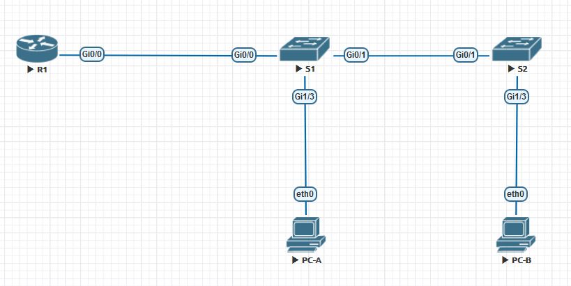

# Лабораторная работа 001

## Задание:
1. Создать схему лабораторной работы в EVE
2. Создать VLAN (в соотвествии с таблицей) и назначить их на порты

|  VLAN |Name   |Interface Assigment   |
| ------------ | ------------ | ------------ |
|  3 |Management   | S1: VLAN 3 S2: VLAN 3 S1: G1/3 S1; G0/0  |
|  4 | Operations  |  S2: G1/3 |
|   7|  ParkingLot |S1: G0/2-3, G1/0-2, G0/1 S2: G0/2-3, G1/0-2, G0/1    |
|   8|  Native |  N/A |

3. Настроить trunk между коммутаторами
4. Настроить маршрутизацию (Router-on-a-Stick)

## Таблица ip адресов
|Device|Interface|IP Address|Subnet Mask|Default Gateway|
|------|---------|----------|-----------|--------------|
|R1|G0/0.3|192.168.3.1|255.255.255.0|N/A|
||G0/0.4|192.168.4.1|255.255.255.0|
|S1|VLAN3|192.168.3.11|255.255.255.0|192.168.3.1|
|S2|VLAN3|192.168.3.12|255.255.255.0|192.168.3.1|
|PC-A|NIC|192.168.3.3|255.255.255.0|192.168.3.1|
|PC-B|NIC|192.168.4.3|255.255.255.0|192.168.4.1|

## 1. Схема лабораторной работы 

## 2. Список VLAN
### Коммутатор S1
<pre>
s1#show vlan brief

VLAN Name                             Status    Ports
---- -------------------------------- --------- -------------------------------
1    default                          active
3    Management                       active    Gi1/3
4    Operations                       active
7    ParkingLot                       active    Gi0/2, Gi0/3, Gi1/0, Gi1/1
                                                Gi1/2
8    VLAN0008                         active
1002 fddi-default                     act/unsup
1003 trcrf-default                    act/unsup
1004 fddinet-default                  act/unsup
1005 trbrf-default                    act/unsup
s1#
</pre>

### Коммутатор S2
<pre>
s2#show vlan brief

VLAN Name                             Status    Ports
---- -------------------------------- --------- -------------------------------
1    default                          active
3    Management                       active    Gi0/0
4    Operations                       active    Gi1/3
7    ParkingLot                       active    Gi0/2, Gi0/3, Gi1/0, Gi1/1
                                                Gi1/2
8    VLAN0008                         active
1002 fddi-default                     act/unsup
1003 trcrf-default                    act/unsup
1004 fddinet-default                  act/unsup
1005 trbrf-default                    act/unsup
s2#
</pre>

## 3. Trunk между коммутаторами

### Коммутатор S1
<pre>
s1#show interfaces trunk

Port        Mode             Encapsulation  Status        Native vlan
Gi0/0       on               802.1q         trunking      8
Gi0/1       on               802.1q         trunking      8

Port        Vlans allowed on trunk
Gi0/0       1-4094
Gi0/1       1-4094

Port        Vlans allowed and active in management domain
Gi0/0       1,3-4,7-8
Gi0/1       1,3-4,7-8

Port        Vlans in spanning tree forwarding state and not pruned
Gi0/0       1,3-4,7-8
Gi0/1       1,3-4,7-8
s1#
</pre>
### Коммутатор S2
<pre>
s2#show interfaces trunk

Port        Mode             Encapsulation  Status        Native vlan
Gi0/1       on               802.1q         trunking      8

Port        Vlans allowed on trunk
Gi0/1       1-4094

Port        Vlans allowed and active in management domain
Gi0/1       1,3-4,7-8

Port        Vlans in spanning tree forwarding state and not pruned
Gi0/1       1,3-4,7-8
s2#
</pre>
## 4. Router-on-a-Stick
### ping с PC-A на default gateway
<pre>
pc-a> ping 192.168.3.1

84 bytes from 192.168.3.1 icmp_seq=1 ttl=255 time=3.532 ms
84 bytes from 192.168.3.1 icmp_seq=2 ttl=255 time=2.444 ms
84 bytes from 192.168.3.1 icmp_seq=3 ttl=255 time=3.102 ms
84 bytes from 192.168.3.1 icmp_seq=4 ttl=255 time=2.434 ms
84 bytes from 192.168.3.1 icmp_seq=5 ttl=255 time=3.372 ms
</pre>
### ping с PC-A на PC-B
<pre>
pc-a> ping 192.168.4.3

84 bytes from 192.168.4.3 icmp_seq=1 ttl=63 time=17.527 ms
84 bytes from 192.168.4.3 icmp_seq=2 ttl=63 time=6.097 ms
84 bytes from 192.168.4.3 icmp_seq=3 ttl=63 time=5.294 ms
84 bytes from 192.168.4.3 icmp_seq=4 ttl=63 time=4.739 ms
</pre>
### ping с PC-A на S2
<pre>
pc-a> ping 192.168.3.11

84 bytes from 192.168.3.11 icmp_seq=1 ttl=255 time=2.327 ms
84 bytes from 192.168.3.11 icmp_seq=2 ttl=255 time=1.483 ms
84 bytes from 192.168.3.11 icmp_seq=3 ttl=255 time=3.170 ms
84 bytes from 192.168.3.11 icmp_seq=4 ttl=255 time=1.860 ms
84 bytes from 192.168.3.11 icmp_seq=5 ttl=255 time=2.098 ms
</pre>
### ping с PC-B на PC-B
<pre>
pc-b> ping 192.168.3.1

84 bytes from 192.168.3.1 icmp_seq=1 ttl=255 time=6.037 ms
84 bytes from 192.168.3.1 icmp_seq=2 ttl=255 time=6.770 ms
84 bytes from 192.168.3.1 icmp_seq=3 ttl=255 time=6.685 ms
84 bytes from 192.168.3.1 icmp_seq=4 ttl=255 time=4.568 ms
</pre>