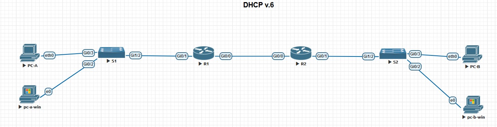

# Лабораторная работа 003

## Задание:
### 1. Настройка DHCP v.4 
1. 1. Создание сети и настройка основных параметров устройства
1. 2. Настройка и проверка DHCP v.4 на маршрутизатора R1
1. 3. Настройка и проверка DHCP Relay на маршрутизаторе R2

## Таблица адресации
|Устройство    |Интрефейс       |IP-адрес    |Маска подсети   | default gateway |
| ------------ | ------------ | ------------ | -------------- | --------------- |
|  R1          | G0/0       | 10.0.0.1  | 255.255.255.252  | |
|              | G0/1       | N/A  | N/A  | |
|          | G0/1.100       | 192.168.1.1  | 255.255.255.192 | |
|          | G0/1.200       | 192.168.1.65  | 255.255.255.224 | |
|          | G0/1.1000       | N/A  | N/A | |
|   |  |  | | |
|  R2          | G0/0       | 10.0.0.2  | 255.255.255.252  | |
|            | G0/1       | 192.168.1.97  | 255.255.255.240  | |
|  |  |  | | |
| S1          | VLAN 200       |   |   | |
| S2          | VLAN 1       |   |   | |
|  |  |  | | |
| PC-A          | NIC       | DHCP   | DHCP   | DHCP |
| PC-B          | NIC       | DHCP   | DHCP   | DHCP |
## Таблица VLAN

| VLAN    | Имя          |  Интерфейс   |
| ------- | ---------    | ---------    |
|  1      |  N/A         | S2: G0/3     |
|  100    |  Clients     | S1: G0/3     |
|  200    |  Management  | S1: VLAN 200 |
|  999    |  Parking_Lot | S1: G0/0 - 2 |
|  1000   |  Native      | N/A |

##  Схема лабораторной работы 

## 1. Настройка лабороторного стенда для DHCP v.4.
Все команды настроек оборудования приведены ы файлах Router R1 DHCP v.4.md, Router R2 DHCP v.4.md, Switch S1 DHCP v.4.md и Switch S2 DHCP v.4.md

## 2. Проверка настройки сервера DHCP v.4.

### На компьютере PC-A
<pre>
PC-A> show ip

NAME        : PC-A[1]
IP/MASK     : 192.168.1.6/26
GATEWAY     : 192.168.1.1
DNS         :
DHCP SERVER : 192.168.1.1
DHCP LEASE  : 217551, 217800/108900/190575
DOMAIN NAME : ccna-lab.com
MAC         : 00:50:79:66:68:05
LPORT       : 20000
RHOST:PORT  : 127.0.0.1:30000
MTU         : 1500
PC-A> ping 192.168.1.1

84 bytes from 192.168.1.1 icmp_seq=1 ttl=255 time=2.743 ms
84 bytes from 192.168.1.1 icmp_seq=2 ttl=255 time=2.382 ms
84 bytes from 192.168.1.1 icmp_seq=3 ttl=255 time=2.326 ms
84 bytes from 192.168.1.1 icmp_seq=4 ttl=255 time=2.316 ms
84 bytes from 192.168.1.1 icmp_seq=5 ttl=255 time=2.192 ms
</pre>
### На маршрутизаторе R1
<pre>
R1#show ip dhcp pool

Pool CLIENTS-POOL :
 Utilization mark (high/low)    : 100 / 0
 Subnet size (first/next)       : 0 / 0
 Total addresses                : 62
 Leased addresses               : 1
 Pending event                  : none
 1 subnet is currently in the pool :
 Current index        IP address range                    Leased addresses
 192.168.1.7          192.168.1.1      - 192.168.1.62      1

Pool R2_Client_LAN :
 Utilization mark (high/low)    : 100 / 0
 Subnet size (first/next)       : 0 / 0
 Total addresses                : 14
 Leased addresses               : 0
 Pending event                  : none
 1 subnet is currently in the pool :
 Current index        IP address range                    Leased addresses
 192.168.1.97         192.168.1.97     - 192.168.1.110     0

R1# show ip dhcp binding
Bindings from all pools not associated with VRF:
IP address          Client-ID/              Lease expiration        Type
                    Hardware address/
                    User name
192.168.1.6         0100.5079.6668.05       May 05 2024 12:20 AM    Automatic

R1#show ip dhcp server statistics
Memory usage         33633
Address pools        2
Database agents      0
Automatic bindings   1
Manual bindings      0
Expired bindings     0
Malformed messages   0
Secure arp entries   0

Message              Received
BOOTREQUEST          0
DHCPDISCOVER         3
DHCPREQUEST          2
DHCPDECLINE          0
DHCPRELEASE          0
DHCPINFORM           0

Message              Sent
BOOTREPLY            0
DHCPOFFER            2
DHCPACK              2
DHCPNAK              0
</pre>
## 3. Проверка настройки DHCP relay

### На компьютере PC-B
<pre>
PC-B> show ip

NAME        : PC-B[1]
IP/MASK     : 192.168.1.102/28
GATEWAY     : 192.168.1.97
DNS         :
DHCP SERVER : 10.0.0.1
DHCP LEASE  : 217790, 217800/108900/190575
DOMAIN NAME : ccna-lab.com
MAC         : 00:50:79:66:68:04
LPORT       : 20000
RHOST:PORT  : 127.0.0.1:30000
MTU         : 1500

PC-B> ping 192.168.1.1

84 bytes from 192.168.1.1 icmp_seq=1 ttl=254 time=3.667 ms
84 bytes from 192.168.1.1 icmp_seq=2 ttl=254 time=3.171 ms
84 bytes from 192.168.1.1 icmp_seq=3 ttl=254 time=3.140 ms
84 bytes from 192.168.1.1 icmp_seq=4 ttl=254 time=2.694 ms
84 bytes from 192.168.1.1 icmp_seq=5 ttl=254 time=2.981 ms
</pre>
### На маршрутизаторе R1
<pre>
R1#show ip dhcp binding
Bindings from all pools not associated with VRF:
IP address          Client-ID/              Lease expiration        Type
                    Hardware address/
                    User name
192.168.1.6         0100.5079.6668.05       May 05 2024 12:20 AM    Automatic
192.168.1.102       0100.5079.6668.04       May 05 2024 01:06 AM    Automatic

R1#show ip dhcp server statistics
Memory usage         42092
Address pools        2
Database agents      0
Automatic bindings   2
Manual bindings      0
Expired bindings     0
Malformed messages   0
Secure arp entries   0

Message              Received
BOOTREQUEST          0
DHCPDISCOVER         6
DHCPREQUEST          4
DHCPDECLINE          0
DHCPRELEASE          0
DHCPINFORM           0

Message              Sent
BOOTREPLY            0
DHCPOFFER            4
DHCPACK              4
DHCPNAK              0
</pre>
### На маршрутизаторе R2
<pre>
R2#show ip dhcp server statistics
Memory usage         22565
Address pools        0
Database agents      0
Automatic bindings   0
Manual bindings      0
Expired bindings     0
Malformed messages   0
Secure arp entries   0

Message              Received
BOOTREQUEST          0
DHCPDISCOVER         0
DHCPREQUEST          0
DHCPDECLINE          0
DHCPRELEASE          0
DHCPINFORM           0

Message              Sent
BOOTREPLY            0
DHCPOFFER            0
DHCPACK              0
DHCPNAK              0
</pre>

### 2. Настройка DHCP v.6 
1. Создание сети и настройка основных параметров устройства
2. Проверка назначения ip адресов череез SLAAC c маршрутизатора R1
3. Настройка и проверка stateful DHCP на маршрутизаторе R1
4. Настройка и проверка DHCP relay на маршрутизаторе R2

## Таблица адресации
|Устройство    |Интрефейс       |IPv6 адрес    |
| ------------ | ------------ | ------------ |
|  R1          | G0/0       | 2001:db8:acad:2::1/64 |
|              |            |fe80::1                |
|              | G0/1       | 2001:db8:acad:1::1/64 |
|              |            | fe80::1               |
|  R2          | G0/0       | 2001:db8:acad:2::2/64 |
|              |            | fe80::2               |
|              | G0/1       | 2001:db8:acad:3::1 /64|
|              |            | fe80::1               |
| PC-A         | NIC        | DHCP                  |
| PC-B         | NIC        | DHCP                  |

##  Схема лабораторной работы 

## 1. Настройка лабороторного стенда для DHCP v.6.
Все команды настроек оборудования приведены ы файлах Router R1 DHCP v.6.md, Router R2 DHCP v.6.md, Switch S1 DHCP v.6.md и Switch S2 DHCP v.6.md
## 2. Проверка назначения ip адресов через SLAAC c маршрутизатора R1
<pre>
PC-A> sh ipv6

NAME              : PC-A[1]
LINK-LOCAL SCOPE  : fe80::250:79ff:fe66:6805/64
GLOBAL SCOPE      : 2001:db8:acad:1:2050:79ff:fe66:6805/64
DNS               :
ROUTER LINK-LAYER : 50:00:00:01:00:01
MAC               : 00:50:79:66:68:05
LPORT             : 20000
RHOST:PORT        : 127.0.0.1:30000
MTU:              : 1500
</pre>
## 3. Настройка и проверка stateful DHCP на маршрутизаторе R1

## 4. Настройка и проверка DHCP relay на маршрутизаторе R2
Получение IPv6 PC-B через SLAAC 
<pre>
PC-B> show ipv6 all

NAME   IP/MASK                                 ROUTER LINK-LAYER  MTU
PC-B   fe80::250:79ff:fe66:6804/64
       2001:db8:acad:3:2050:79ff:fe66:6804/64  50:00:00:02:00:01  1500
</pre>