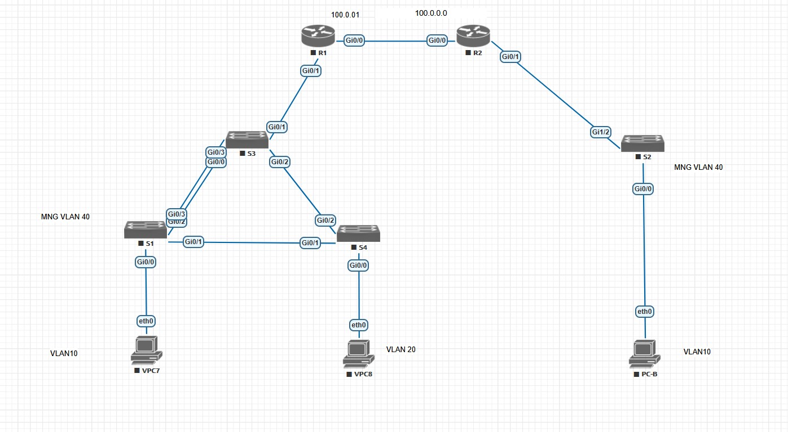

# Лабораторная работа 004

## Задание:
### 1. Настройка VLAN, STP и агрегации каналов
1. 1. Настройка VLAN на коммутаторах S1–S4
1. 2. Настройка STP (Rapid-PVST), выбор корневого коммутатора
1. 3. Настройка агрегации каналов (EtherChannel LACP) между S1 и S3
1. 4. Отключение неиспользуемых портов (Parking_Lot)

### 2. маршрутизация между VLAN
1. 1. Настройка Router-on-a-Stick на маршрутизаторах R1 и R2
1. 2. Статическая маршрутизация между сегментами через WAN

## Схема лабораторной работы

## Таблица VLAN

| VLAN | Имя         | Назначение / интерфейсы                                    |
| ---- | ----------- | ---------------------------------------------------------- |
| 10   | Clients     | S1: G0/0 (VPC7), S2: G0/0 (PC-B)                            |
| 20   | Clients2    | S4: G0/0 (VPC8)                                             |
| 40   | MNG         | Управление коммутаторами (SVI VLAN 40 на S1–S4)             |
| 999  | Parking_Lot | Неиспользуемые порты                                        |

## Таблица адресации

| Устройство | Интерфейс      | IP-адрес       | Маска подсети   | Шлюз по умолчанию |
| ---------- | -------------- | -------------- | --------------- | ----------------- |
| R1         | G0/0           | 100.0.0.1      | 255.255.255.0   |                   |
|            | G0/1.10        | 192.168.10.1   | 255.255.255.0   |                   |
|            | G0/1.20        | 192.168.20.1   | 255.255.255.0   |                   |
|            | G0/1.40        | 192.168.40.1   | 255.255.255.0   |                   |
| R2         | G0/0           | 100.0.0.2      | 255.255.255.0   |                   |
|            | G0/1.10        | 192.168.110.1  | 255.255.255.0   |                   |
|            | G0/1.40        | 192.168.140.1  | 255.255.255.0   |                   |
| S1         | VLAN 40        | 192.168.40.11  | 255.255.255.0   | 192.168.40.1      |
| S2         | VLAN 40        | 192.168.140.12 | 255.255.255.0   | 192.168.140.1     |
| S3         | VLAN 40        | 192.168.40.13  | 255.255.255.0   | 192.168.40.1      |
| S4         | VLAN 40        | 192.168.40.14  | 255.255.255.0   | 192.168.40.1      |
| VPC7       | eth0           | 192.168.10.10  | 255.255.255.0   | 192.168.10.1      |
| VPC8       | eth0           | 192.168.20.10  | 255.255.255.0   | 192.168.20.1      |
| PC-B       | eth0           | 192.168.110.10 | 255.255.255.0   | 192.168.110.1     |

## Сегменты VLAN

У S2 нет L2-пути к S1/S3/S4 — он подключён только к R2, поэтому VLAN 10 и 40 существуют в двух
изолированных широковещательных доменах:

| Сегмент                 | VLAN 10       | VLAN 40       |
| ----------------------- | ------------- | ------------- |
| S1/S3/S4 (сеть R1)      | 192.168.10.0/24 | 192.168.40.0/24 |
| S2 (сеть R2)            | 192.168.110.0/24 | 192.168.140.0/24 |

Связь между сегментами обеспечивают статические маршруты через сеть WAN 100.0.0.0/24.

## Таблица агрегации каналов

| Коммутатор | Порты               | Протокол | Port-Channel | Назначение |
| ---------- | ------------------- | -------- | ------------ | ---------- |
| S1         | Gi0/2, Gi0/3        | LACP     | Po1          | Link to S3 |
| S3         | Gi0/0, Gi0/3        | LACP     | Po1          | Link to S1 |

## Настройка оборудования
Все команды настроек приведены в файлах:
Router R1.md, Router R2.md, Switch S1.md, Switch S2.md, Switch S3.md, Switch S4.md

## Проверка

### Проверка EtherChannel
На S1 и S3:
<pre>
S1#show etherchannel summary
Flags:  D - down        P - bundled in port-channel
        I - stand-alone s/s
        H - Hot-standby (LACP only)
        s - suspended
        R - Layer3      S - Layer2
        U - in use      f - failed to allocate aggregator
        M - not in use, minimum links not met
        u - unsuitable for bundling
        w - waiting to be aggregated
        d - default port

Number of channel-groups in use: 1
Number of aggregators:           1

Group  Port-channel  Protocol    Ports
------+-------------+-----------+-------------------------------
1      Po1(SU)         LACP      Gi0/2(P)  Gi0/3(P)
</pre>

### Проверка STP
Корневым коммутатором для всех VLAN является S3, резервным — S1:
<pre>
S3#show spanning-tree vlan 10

VLAN0010
  Spanning tree enabled protocol rstp
  Root ID    Priority    24586
             Address     5000.0003.0000
             This bridge is the root
</pre>

### Проверка маршрутизации между VLAN
VPC7 -> VPC8 (VLAN 10 -> VLAN 20 через R1):
<pre>
VPC7> ping 192.168.20.10
84 bytes from 192.168.20.10 icmp_seq=1 ttl=254 time=2.743 ms
</pre>

VPC7 -> PC-B (через WAN R1 -> R2):
<pre>
VPC7> ping 192.168.110.10
84 bytes from 192.168.110.10 icmp_seq=1 ttl=253 time=3.667 ms
</pre>

### Проверка управления коммутаторами
<pre>
S4#ping 192.168.40.1

Type escape sequence to abort.
Sending 5, 100-byte ICMP Echos to 192.168.40.1, timeout is 2 seconds:
!!!!!
Success rate is 100 percent (5/5)
</pre>